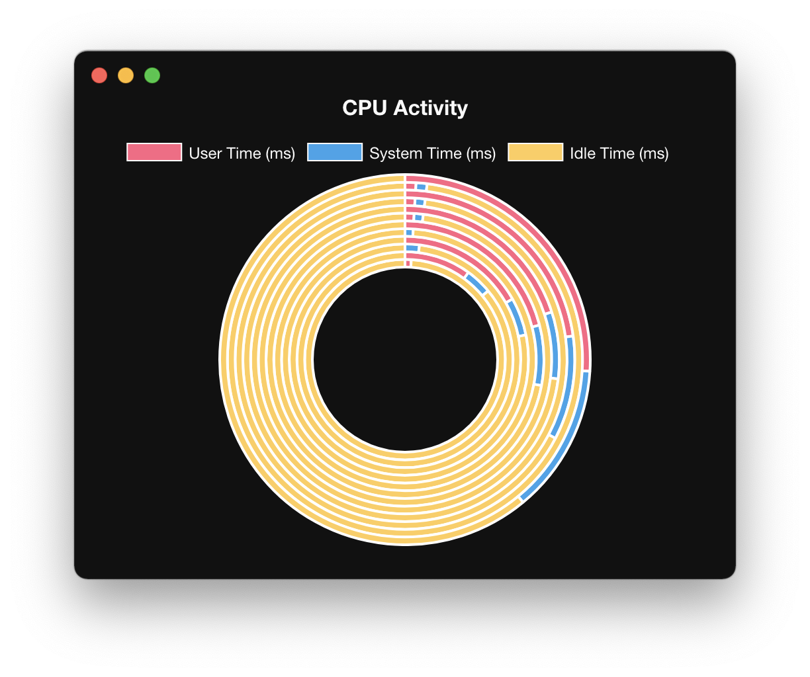

# activity-monitor-test
## これは何？
- Electronを使った習作
  - アクティビティモニタを作った
- 以下のサンプルはJavaScriptとjQueryで書かれているが、これをTypeScriptで書き換えた
  - https://www.electronjs.org/blog/simple-samples#activity-monitor



## 動かし方
```bash
$ npm install
$ npm run start
```